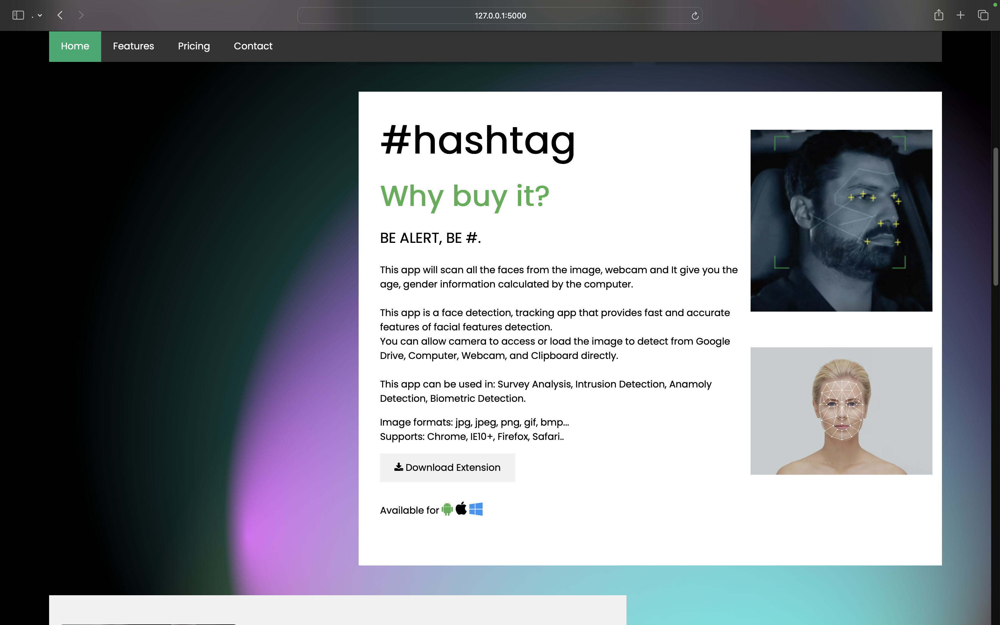
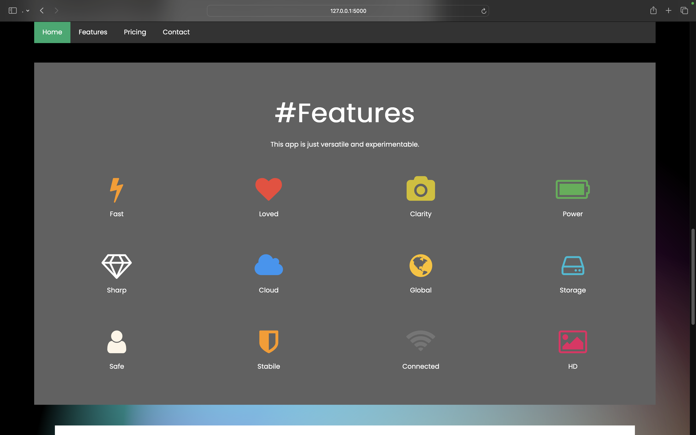
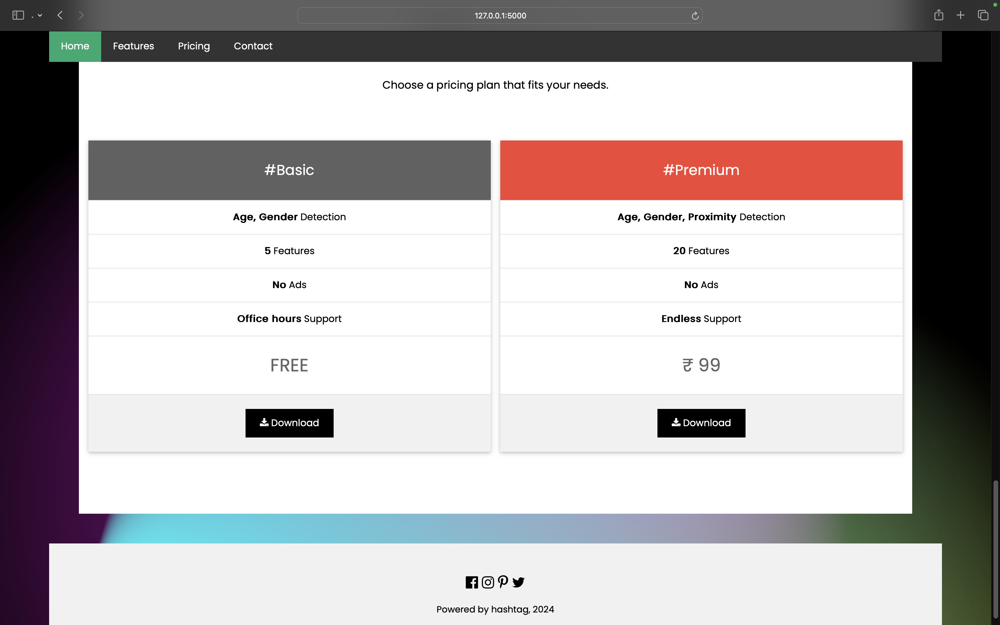

# #hashtag: Age-and-Gender-Detection

<h2>Objective :</h2>

To build a gender and age detector extension tool that can approximately guess the gender and age of the person (face) in a picture or through webcam.

<h2>About the Project :</h2>

In this Project, we had used Deep Learning to accurately identify the gender and age of a person from a single image of a face.We used the models trained by <a href="https://talhassner.github.io/home/projects/Adience/Adience-data.html">Tal Hassner and Gil Levi</a>. The predicted gender may be one of ‘Male’ and ‘Female’, and the predicted age may be one of the following ranges- (0 – 2), (4 – 6), (8 – 12), (15 – 20), (25 – 32), (38 – 43), (48 – 53), (60 – 100) (8 nodes in the final softmax layer). It is very difficult to accurately guess an exact age from a single image because of factors like makeup, lighting, obstructions, and facial expressions. And so, we further made an extension which can be used with various systems to provide additional features

<h2>Dataset :</h2>

For this project, we had used the Adience dataset; the dataset is available in the public domain and you can find it <a href="https://www.kaggle.com/ttungl/adience-benchmark-gender-and-age-classification">here</a>. This dataset serves as a benchmark for face photos and is inclusive of various real-world imaging conditions like noise, lighting, pose, and appearance. The images have been collected from Flickr albums and distributed under the Creative Commons (CC) license. It has a total of 26,580 photos of 2,284 subjects in eight age ranges (as mentioned above) and is about 1GB in size. The models we used had been trained on this dataset.

<h2>Python Libraries Required :</h2>
<ul>
  <li>Run on CMD</li>
  
       pip install -r requirements.txt
</ul>

 
# Working:

<h2>Examples :</h2>

<b>NOTE:- Reference images are from Google,if you have any query or problem we can remove them.</b>

    >python model.py --image Detecting age and gender girl1.png
    Gender: Female
    Age: 25-32 years
    

    >python model.py --image Detecting age and gender girl2.png
    Gender: Female
    Age: 8-12 years
    

    >python model.py --image Detecting age and gender kid1.png
    Gender: Male
    Age: 4-6 years    
    

    >python model.py --image Detecting age and gender kid2.png
    Gender: Female
    Age: 4-6 years  
    

    >python model.py --image Detecting age and gender man1.png
    Gender: Male
    Age: 38-43 years
    

    >python model.py --image Detecting age and gender man2.png
    Gender: Male
    Age: 25-32 years
    

    >python model.py --image Detecting age and gender woman1.png
    Gender: Female
    Age: 38-43 years
    

 # PREVIEW:

  ### Website:

  ### Prototype:

https://github.com/aksshatgovind/Age-and-Gender-Detection/assets/105073216/e15cc2b3-52da-48b3-ad95-f587786317ca

 # EXTENSION:

 ### Click 'Download Extension' to download our GAD.exe file

  
 
 
<b>NOTE:- We have completed with our executable extension for now. We'll keep updating to the contents of this repo, and thank you for your time.</b>

 
